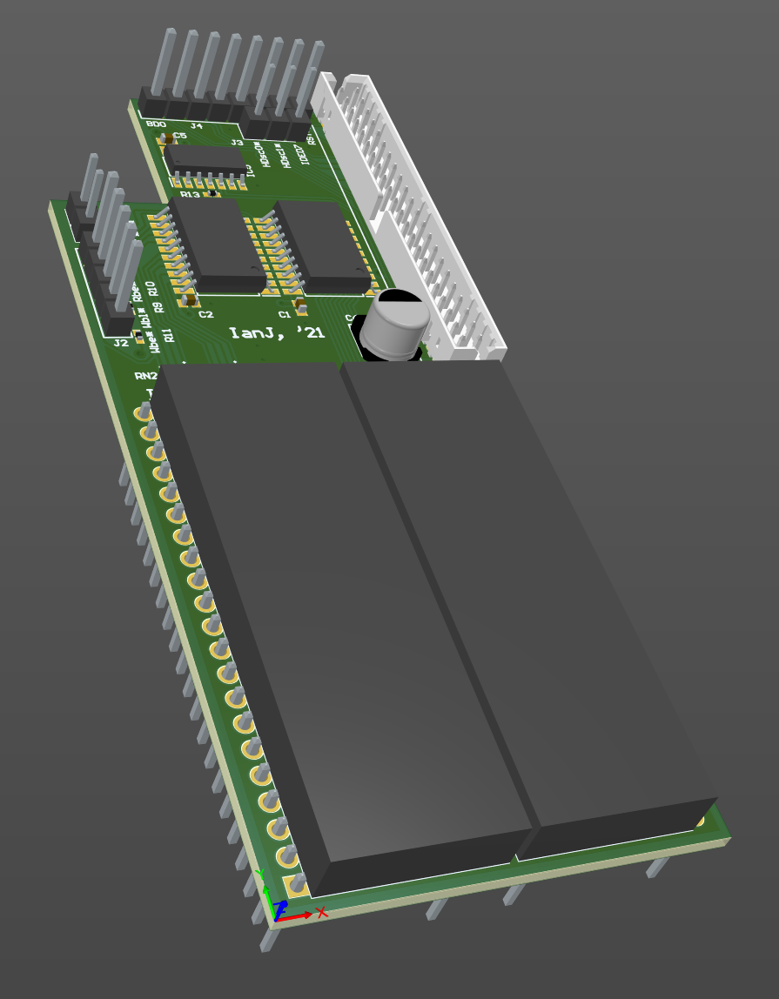

# Acorn A3010 IDE interface

March 2023

This is my implementation of an IDE interface add-on for Acorn A3010 machines, utilising the internal IDE controller.
The design was heavily inspired by the work of 'Vectorlight' on StarDot, plus my own additional input after understanding the appropriate parts of the Acorn A3020 design to pinch.
The board layout is wholly my own and designed to hard-mount a 'DOM'.

The design has been tested successfully and at length in several A3010 machines.

## Licence

No warranty is provided, and this work is used at your own risk.  

Licenced as CC BY-SA 3.0

Copyright 2023 Ian Jeffray

